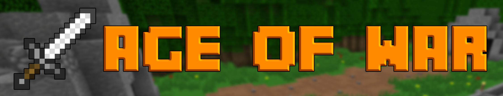
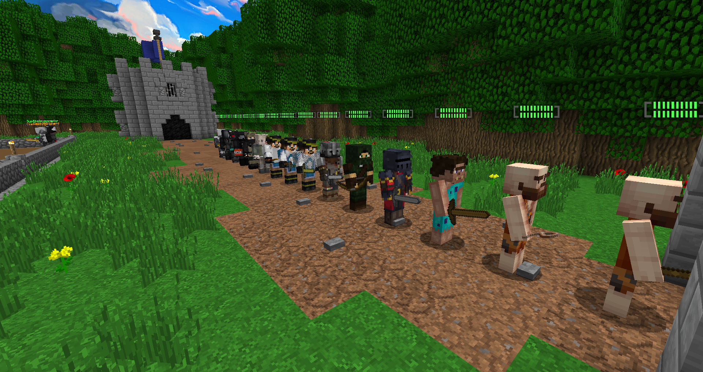
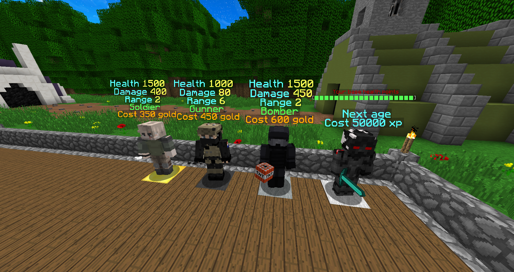
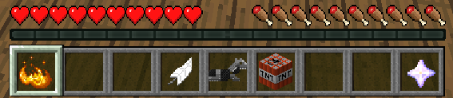
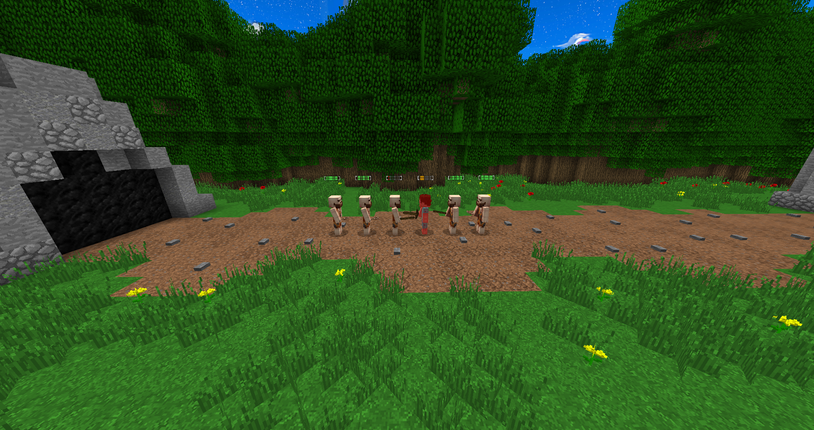
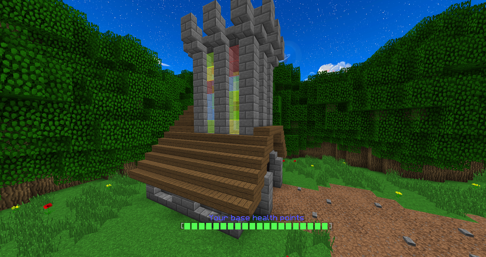
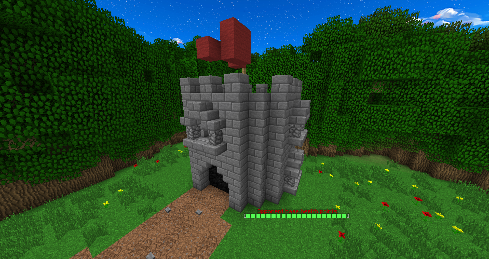

# Age of War plugin
This plugin is a based on the old flash game Age of War (the first one) some elements differ from the original game.\
The goal of the game is to defend your base while trying to destroy your opponent base.

## About the original game
Originally released in 2007 by Louissi, Age of War became a timeless classic, with many regarding it as the birth of the popularization of flash games. In these base defense games, you play as a defender of your base and spawn units which act as both defense and offence, marching linearly across the map to the opponent's (an AI) base. If a base's hit points (HP) drop to zero, the opponent wins. As such, the objective of the game is to reduce the opponent's base HP to zero.

## Features

### Combat units
There is 15 different combat units, 3 per age. All of them have different stats and effects on the game.\

### Shop NPC
On every age you have 3 NPCs in front of you used for purchasing units.\
The fourth NPC is used to evolve to the next age when you have enough XP to do so.\

### Items
Items are an alternative way to buy units and/or evolve.\
The only special item is the first one used to invoke your age special skill.\

### Combat
As you'd expect the combat system exactly work like Age of War.\
All units go on a straight line to the opponent base and fight the first unit in front of them.\

### Bases
All the bases in the game change look to match your current age while somewhat respecting the original game bases look.\
Here are some examples.\

\
\
\
